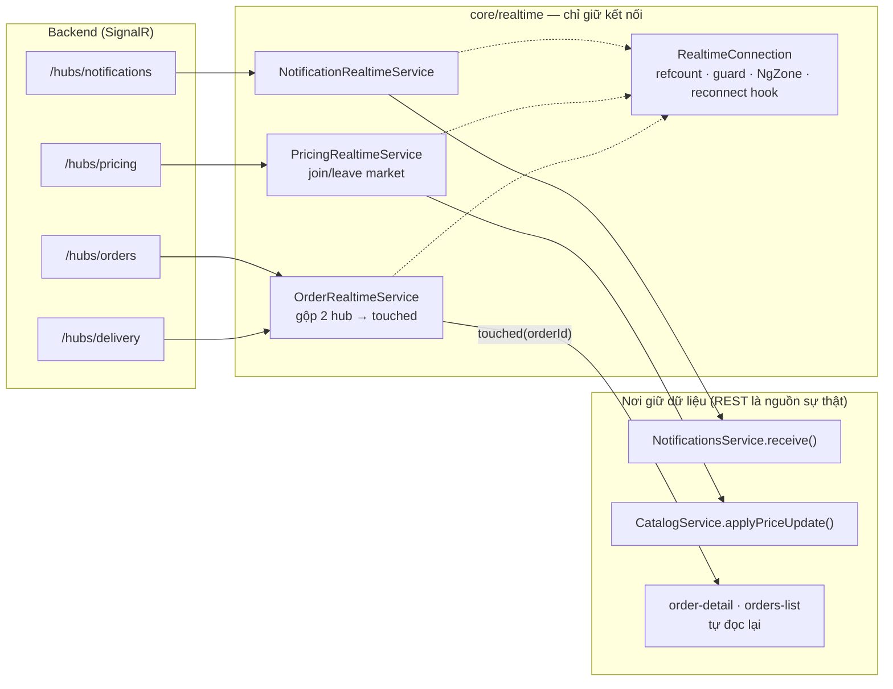

# Implementation Plan: Realtime cho client web

**Ngày**: 2026-08-24 | **Trạng thái**: đã triển khai (notifications, pricing, orders, delivery)

## Tóm tắt

Backend đã chạy SignalR đầy đủ từ lâu — bốn hub, phát sau khi commit — nhưng web không nghe hub
nào. Tài liệu này ghi lại tầng realtime vừa dựng cho `freshflow-web`: một lõi kết nối dùng chung,
ba service theo miền, và bốn màn hình tiêu thụ.

Nguyên tắc xuyên suốt: **realtime không sở hữu dữ liệu**. REST vẫn là nguồn sự thật; một event chỉ
nói "cái này vừa đổi", và bên đang giữ dữ liệu tự quyết định vá tại chỗ hay đọc lại. Nhờ vậy một
event bị mất không bao giờ làm hỏng màn hình — lần đọc kế tiếp vẫn đúng.

## Ngữ cảnh kỹ thuật

**Client**: `@microsoft/signalr` 10.0.11 (cùng major với `freshflow-app`), Angular 22 signals,
strict TS.

**Bốn hub** (`freshflow-backend/src/FreshFlow.API/Program.cs:330-333`):

| Hub                   | Group                                         | Event                                    | Web tiêu thụ ở đâu             |
| --------------------- | --------------------------------------------- | ---------------------------------------- | ------------------------------ |
| `/hubs/notifications` | tự join `user:{userId}`                       | `NotificationCreated`                    | chuông thông báo               |
| `/hubs/pricing`       | **client tự gọi** `JoinMarketAsync(marketId)` | `PriceUpdated`                           | lưới sản phẩm + trang chi tiết |
| `/hubs/orders`        | tự join `admin:orders` \| `restaurant:{id}`   | `OrderStatusChanged`                     | danh sách đơn + chi tiết đơn   |
| `/hubs/delivery`      | tự join `admin:delivery` \| `restaurant:{id}` | `DeliveryStarted`, `DeliveryStopUpdated` | như trên                       |

## Quyết định kiến trúc

| Vấn đề            | Chọn                                                                                    | Loại bỏ                           | Vì sao                                                                                                              | Cái giá                                                        |
| ----------------- | --------------------------------------------------------------------------------------- | --------------------------------- | ------------------------------------------------------------------------------------------------------------------- | -------------------------------------------------------------- |
| Số kết nối        | Mỗi hub một `RealtimeConnection`                                                        | Một socket chung                  | Bốn hub là bốn endpoint riêng; gộp là không thể                                                                     | Tối đa 4 socket/tab                                            |
| Ai giữ vòng đời   | Service `providedIn: 'root'`, màn hình `connect()`/`disconnect()` có **đếm tham chiếu** | Component tự dựng `HubConnection` | Hai chuông cùng mount (header + thanh mobile) là có thật; đóng theo cái đầu tiên rời đi sẽ cắt feed của cái còn lại | Phải nhớ release khi destroy                                   |
| Ranh giới state   | Realtime ghi vào signal của service REST sẵn có; không có store riêng                   | Store realtime riêng              | Một bản sự thật cho cả REST lẫn socket                                                                              | Service REST lộ thêm một method ghi                            |
| Đơn hàng          | Event → tín hiệu `touched`, màn hình **đọc lại**                                        | Vá status vào row                 | Broadcast chỉ mang status, không mang tổng tiền/mục hàng; vá vào sẽ tạo dòng tự mâu thuẫn                           | Thêm một request mỗi lần đổi trạng thái                        |
| Bảng giá          | Vá tại chỗ theo `marketProductId`                                                       | Đọc lại toàn bộ listing           | Listing là crawl toàn thị trường (⌈n/100⌉ request) — đọc lại mỗi lần đổi giá là không chấp nhận được                | Chỉ vá được 2 trường event mang theo                           |
| `currentQuantity` | Ghi vào `totalQuantity`, **không** ghi `quantity`                                       | Ghi vào `quantity`                | `currentQuantity` là tồn kho trước khi trừ đơn đang giữ chỗ; ghi vào availability sẽ bán vượt                       | Availability chờ lần đọc sau                                   |
| Token             | `getValidAccessToken()` — refresh trước khi negotiate                                   | Dùng token trong localStorage     | Negotiate không có cơ hội retry như HTTP 401; mọi reconnect dùng lại chính factory này                              | Thêm một nhánh giải mã JWT                                     |
| Transport         | Để SignalR tự negotiate (WS → SSE → long-polling)                                       | `skipNegotiation` + ép WebSocket  | Chưa xác minh được nginx trên VPS có `proxy_set_header Upgrade`; ép WS mà proxy chặn là chết hẳn thay vì chạy chậm  | Thêm 1 round-trip; có thể đang chạy long-polling mà không biết |
| Payload           | Type guard cho từng event, loại thì **bỏ im lặng**                                      | Tin payload                       | Hub không có schema; field đổi tên sẽ thành `undefined` trên giao diện                                              | Event hợp lệ mà guard viết sai sẽ bị bỏ                        |
| Vào lại Angular   | `NgZone.run()` trong lõi                                                                | Để component tự lo                | Callback socket nằm ngoài zone, mọi màn hình đều `OnPush`                                                           | Không                                                          |
| Test              | Seam `HUB_CONNECTION_FACTORY` + `FakeHub`                                               | Integration test mở socket thật   | Cái đáng test là re-join sau reconnect và đếm tham chiếu — không thể ép server thật sinh ra đúng lúc                | Fake phải bám sát API thật                                     |

## Sơ đồ



## Cấu trúc

```
src/app/core/realtime/
├── realtime-connection.ts        # lõi + HUB_CONNECTION_FACTORY (seam test)
├── notification-realtime.service.ts
├── pricing-realtime.service.ts
├── order-realtime.service.ts     # 2 hub, 1 tín hiệu `touched`
├── fake-hub.ts                   # hub giả cho test
└── *.spec.ts
```

Consumer: `notifications.component.ts`, `catalog.component.ts`, `orders-list.component.ts`,
`orders/pages/order-detail/order-detail.component.ts`.

## Bù khoảng trống khi mất kết nối

Hub **không replay**. Mỗi feature khai báo việc phải làm sau `onreconnected`:

| Feature       | Sau khi nối lại                                                                     |
| ------------- | ----------------------------------------------------------------------------------- |
| Notifications | `reload()` trang đầu danh sách                                                      |
| Pricing       | `JoinMarketAsync` **lại** (client không tự khôi phục group) → `loadMarketListing()` |
| Orders        | Màn hình đang mở tự đọc lại (`setReconnectHandler`)                                 |

Việc re-join của Pricing là lỗi im lặng nguy hiểm nhất trong cả tầng này: không re-join thì socket
vẫn "khoẻ", không có lỗi nào, và không bao giờ nhận được gì nữa.

## Giới hạn đã biết (dùng cho báo cáo)

1. **Một instance.** `Program.cs:197` chỉ `AddSignalR()`. Khoá `SignalR:UseRedis` có trong
   `appsettings.json` và được bật trong `docker-compose.dev-vps.yml` nhưng **không dòng C# nào đọc**
   — chạy nhiều instance sẽ mất event của client nối vào instance khác.
2. **Chưa xác minh WebSocket trên VPS.** nginx/1.18 đứng trước API; file conf nằm ngoài repo. Không
   probe được từ ngoài vì `[Authorize]` chạy trước middleware WebSocket. Nếu thiếu header `Upgrade`,
   SignalR tự lùi về SSE/long-polling — vẫn chạy đúng, chỉ tốn hơn.
3. **Token nằm trên query string.** Bắt buộc với WebSocket trong trình duyệt; hệ quả là token có thể
   xuất hiện trong log nginx. Giảm nhẹ bằng TTL access token ngắn.
4. **Mỗi tab một bộ socket.** Chưa chia sẻ qua `BroadcastChannel`/SharedWorker.
5. **Không tạm dừng khi tab ẩn.** Đánh đổi: giữ kết nối để quay lại tab là thấy ngay.

## Câu hỏi còn mở

-   Có cần chỉ báo "live/offline" trên giao diện không? Tín hiệu `connected` đã có sẵn ở cả ba service,
    chưa màn nào hiển thị.
-   Bảng đơn của admin console (`admin/order-groups`) chưa nối realtime — có đáng làm không, hay ops
    vẫn F5 theo thói quen?
